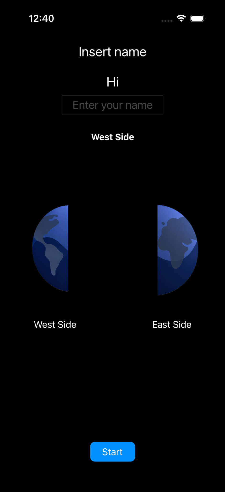
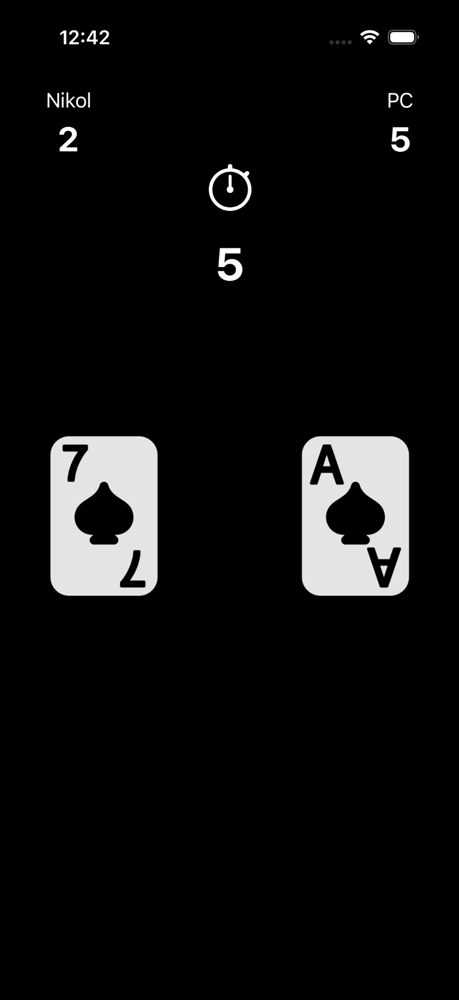
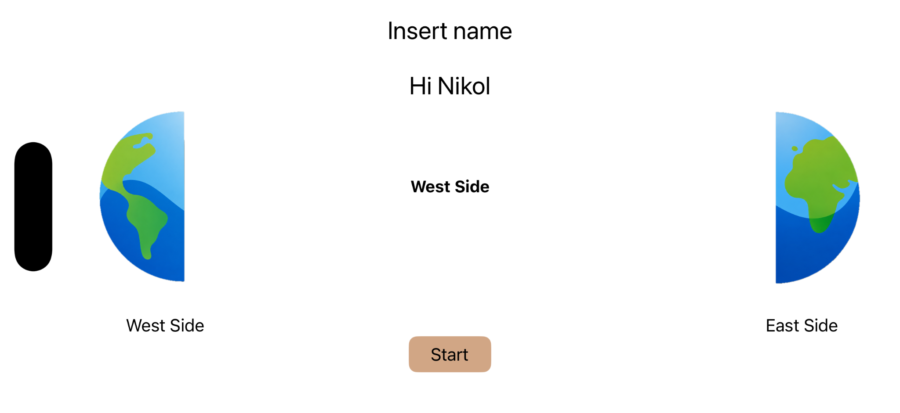

# IOS Card Game Project

This is an iOS card game application built with Swift, UIKit and Storyboard.

## Features

- Save player name using UserDefaults
- Get user location using CoreLocation
- Decide player side by longitude: East Side / West Side
- Automatic card game with 10 rounds
- Score calculation for player and PC
- Result screen with winner and score
- Back to main menu button
- Light Mode and Dark Mode support
- Landscape and Portrait layout support

## Screenshots

  
  
  

  

## Demo Video

## Demo Video

🎥 [Watch Demo Video](https://github.com/nikolpinchevsky/IOSproject/blob/main/video/My%20Movie.mp4)

## How to Run

1. Open the project in Xcode.
2. Choose an iPhone simulator.
3. Run the project.
4. Allow location permission.
5. Enter a name and press Start.
